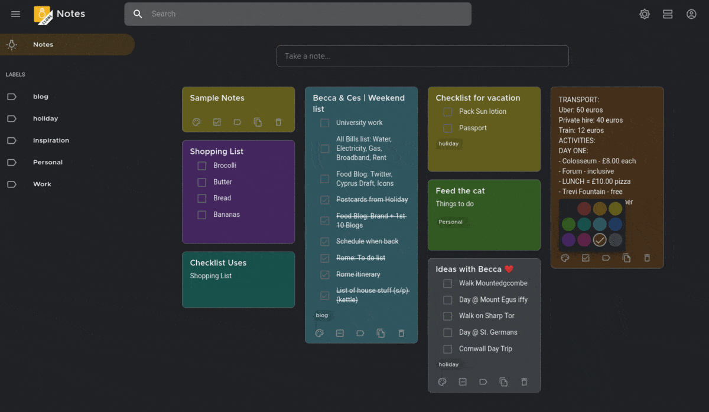
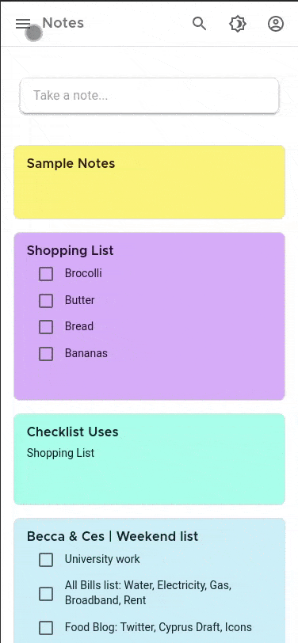
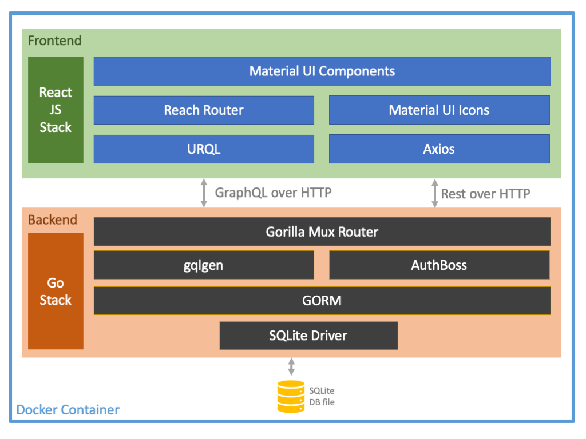

#  A Clone of Google Keep

A minimal *Clone* of [Google Keep](https://keep.google.com) written in [ReactJS](https://reactjs.org/) with [Material UI Components](https://material-ui.com/), themed to look exactly like *Google Keep*, with complex features like sharing, archiving, reminders etc. shoved away. The backend is a [GraphQL](https://graphql.org/) server written in [Golang](https://golang.org/), with data persisted in [SQLite](https://sqlite.org) DB file, via [GORM](https://gorm.io). The server implementation is complete with *Cookie based Authentication*, implemented using [Authboss](https://github.com/volatiletech/authboss).


<div align="center">


<br/>*Light and Dark theme*

</div>

## Features

* 🔐 **Login** & 🔏 **Register** for creating a new user

* 🌈 **Colors**, 📐 **Sizes**, ❮❯ **Margins**, ❯❮ **Paddings** etc., matches exactly that of *Google Keep*'s Web App

* 📲 **Responsive Design** - Adapts all screen sizes from mobile screens up to 4k displays

* 🌚 **Dark Mode** - Dynamically change light/dark theme

* 📝 **Notes** - Create, Update, *Copy*, Delete items on the fly. Dynamically change between these 2 modes

  * 🗒 **Simple Notes** - Update/delete text in a simple text mode

  * ☑️ **Todos with Checkboxes** - Mark items complete/incomplete using the checkbox

* 🚥 **Colors** - Assign colors to Notes & adapts to dark/light theme

* 📜 **Display Mode** - Notes can appear in the canvas in 2 different modes

  * **List** - Displays notes as one item per row

  * **Tile** - Displays notes as tiles, and spread across the canvas

*  🏷 **Labels** - Label your notes, assign/unassign labels dynamically and filter notes by selecting labels in Sidebar

* 🔗 **Subscriptions** - When notes are created/deleted in different browser tabs, the updates are pushed from server to client

<div align="center">

  [](https://googlekeep-anselm94.herokuapp.com/)

</div>

<div align="center">


<br/>*Toggling themes, adding notes and assigning color and label. Later marking it as complete*

</div>

## Libraries Used

#### Frontend

* [ReactJS](https://reactjs.org) - See [`Web source`](./web/src)

  - Complete frontend JS framework

  - Follows [*React Hooks*](https://reactjs.org/docs/hooks-intro.html) pattern

* [MaterialUI](http://material-ui.com/) - See [`Login.js`](web/src/components/Login.js)

  - Follows the *new* [Material Design](https://material.io/) guidelines (known as *Material v2*)

  - Completely themed to adapt Google's version for *Keep* - See [`theme.js`](./web/src/theme.js)

  - Uses [Montserrat](https://fonts.google.com/specimen/Montserrat) font to match Google's Product Sans (*See [this Subreddit post](https://www.reddit.com/r/androiddev/comments/a6q5js/free_font_which_is_similar_to_google_product_sans/ebx6y2x?utm_source=share&utm_medium=web2x)*) and [Roboto](https://fonts.google.com/specimen/Roboto) font - See [`fonts.js`](./web/src/assets/fonts.js)

* [MaterialUI Icons](https://material-ui.com/components/material-icons/) - See [`AppBar.js`](./web/src/components/appbar/AppBar.js)

  - Uses *Outlined* Icon design

* [Reach Router](https://reach.tech/router) - See [`App.js`](./web/src/App.js)

  - For client-side (browser) routing

* [URQL](https://formidable.com/open-source/urql/) - See [`gql.js`](./web/src/gql.js)

  - Complete [GraphQL](https://graphql.org/) client-side JS library

  - Provides [React-hooks](https://formidable.com/open-source/urql/docs/basics/queries/) based implementations

  - Has [*Subscriptions*](https://formidable.com/open-source/urql/docs/advanced/subscriptions/) (via *Websockets*) for dynamic updates from server (to create/delete notes with different tabs open)

* [Axios - React Hooks](https://github.com/simoneb/axios-hooks) - See [`Login.js`](web/src/components/Login.js)

  - *React-hook* based extension for [Axios](https://github.com/axios/axios)

#### Backend

* [Gorilla Mux](https://www.gorillatoolkit.org/pkg/mux) - See [`main.go#main()`](./cmd/server/main.go#L73)

* [GORM](https://gorm.io/) - See [`models_gen.go`](./server/models_gen.go)

* [gqlgen](https://gqlgen.com/) - See [`resolver.go`](./server/resolver.go)

* [AuthBoss](https://github.com/volatiletech/authboss) - See [`main.go#setupAuthboss()`](./cmd/server/main.go#L94)

#### Deployment

* [Docker - Multistage build](https://docs.docker.com/develop/develop-images/multistage-build/) - See [`Dockerfile`](./Dockerfile)

  - Builds a deployable Docker image in 3 stages

    * *Stage 1* - Builds runtime binary for Golang server

    * *Stage 2* - Builds Production-ready ReactJS artifacts

    * *Stage 3* - Assembles the artifacts from *Stage 1* & *Stage 2*, and builds a container image

* [Heroku - Container Deployment](https://devcenter.heroku.com/categories/deploying-with-docker) - See [`heroku.yml`](./heroku.yml)

  - Builds and deploys the Docker image, with a `git push`

## Design



This diagram explains the high-level architecture design of this project. This stack is a *Monolith*, with frontend-backend-database all packed into one single *container* deployment. Frontend is a *ReactJS* stack. 

The **Frontend** is built with *ReactJS* using *Material UI React* components. The state management is through *React's Hooks for State, Context & Reducer* (see [`store.js`](web/src/store.js)). The main application is available at root `/`, which on load tries to load the noteitems. 

Since the user will not authenticated by this time, the *Router* navigates the user to `/login` where the user can enter `email` & `password` to login. To register for a new user, the user clicks on the 'Register' link to navigate to `/register` route. The user may enter any `name`, `email` (no email verification in place) and `password`. All Login & Registration HTTP calls are REST and are made via *Axios* React *Hooks* API.

Once logged in, a session cookie will be set in the browser. Now, the *GraphQL* API is available at `/query` and *URQL* client loads all the *Notes*, *Labels* & *User* information, in a single *query* (However, has to be optimised, as URQL's caching mechanism, makes involuntary calls, whenever any of the *mutation* happens). UI displays the items. User may create, update, delete *note* items, and may also create & assign/unassign labels to note items. The *labels* may be added, but update/delete hasn't be implemented now. User can sign out, by clicking the 'Profile' icon and then 'Sign Out' button.

The **Backend** is built with *Golang* and no server framework is used, except *Gorilla Mux*, which provides utils for *routing*. The router consists for 3 major routes:

* `/` - handles UI resources

* `/query` - handles GraphQL requests and will be delegated to *gqlgen* generated GraphQL handlers. Throws `NotAuthenticated` error, if user is unauthenticated. Also, understands user information, via session cookie.

* `/auth` - handles all authentication related requests and will be delegated to *AuthBoss* framework. The `/auth/register`, `/auth/login` & `/auth/logout` routes handle Registration, Login & Logout respectively.

The DB is a *SQLite* DB and the persistence is a `file` based API. *GORM* allows quick and easy Database modelling. The database tables are generated as per the modelling defined as *Go Structs* (see [models_gen.go](./server/models_gen.go)). The database modelling is done as per this *ER Diagram*


Both *gqlgen* & *AuthBoss* has resolvers. *gqlgen*'s resolvers (see [`resolver.go`](./server/resolver.go)) helps in resolving Notes related data from database. While *AuthBoss*'s resolvers (see [`storer.go`](./server/storer.go)) help in resolving user related information.

The **Deployment** is through a muti-stage Docker build, which facilitates building Go binary and ReactJS artifacts in one single command. The *Docker image* generated is a *Monolith*, which can be deployed & run, without any other external setup.

## How to Setup and Build

### Method 1: Docker

1) Clone the Git repository

```sh
git clone https://github.com/anselm94/googlekeepclone.git
```

2) CD into the folder

```sh
cd googlekeepclone
```

3) Build a docker image containing all the web resources and server executable

```sh
docker build -t anselm94/googlekeepclone .
```

4) Run the Docker image as a container

```sh
docker run -p 8080:8080 -e PORT=8080 anselm94/googlekeepclone:latest
```

5) Open the URL in browser - https://localhost:8080

### Method 2: Manual

1) Clone the Git repository

```sh
git clone https://github.com/anselm94/googlekeepclone.git
```

2) CD into the Web folder

```sh
cd googlekeepclone/web
```

3) Install Node dependencies (Install [NodeJS](https://nodejs.org/en/download/) in prior) and build the resources into `/build` folder

```
EXPORT REACT_APP_WEBSOCKET_ENDPOINT=ws://localhost:8080/query
npm install
npm run build
```

4) Run the Golang server (Install [golang](https://golang.org/dl/) in prior)

```
cd ..
export HOST=http://localhost
export PORT=3000
export STATIC_DIR=web/build
export DB_FILE=keepclone.db
export COOKIE_STORE_KEY=$(uuidgen | base64)
export SESSION_STORE_KEY=$(uuidgen | base64)
go run ./cmd/server/main.go
```

5) Open the URL in browser - 
  - Root - http://localhost:3000
  - GraphQL Playground - http://localhost:3000/playground

## Development

1) Clone the Git repository

```sh
git clone https://github.com/anselm94/googlekeepclone.git
```

2) Download and Install [Visual Studio Code](https://code.visualstudio.com/)

3) Start the **Go server** in *Debug* mode. See [`launch.json`](./.vscode/launch.json)

    * Go to 'Run' -> 'Launch Go API server'

4) Start the **React Dev Server** task. See [`tasks.json`](./.vscode/tasks.json)

    * Press 'Ctrl + Shift + P' -> 'Tasks: Run tasks' -> Select 'Start React server'

5) Launches https://localhost:3000 in the browser

## License

```
MIT License

Copyright (c) 2020 Merbin J Anselm

Permission is hereby granted, free of charge, to any person obtaining a copy
of this software and associated documentation files (the "Software"), to deal
in the Software without restriction, including without limitation the rights
to use, copy, modify, merge, publish, distribute, sublicense, and/or sell
copies of the Software, and to permit persons to whom the Software is
furnished to do so, subject to the following conditions:

The above copyright notice and this permission notice shall be included in all
copies or substantial portions of the Software.

THE SOFTWARE IS PROVIDED "AS IS", WITHOUT WARRANTY OF ANY KIND, EXPRESS OR
IMPLIED, INCLUDING BUT NOT LIMITED TO THE WARRANTIES OF MERCHANTABILITY,
FITNESS FOR A PARTICULAR PURPOSE AND NONINFRINGEMENT. IN NO EVENT SHALL THE
AUTHORS OR COPYRIGHT HOLDERS BE LIABLE FOR ANY CLAIM, DAMAGES OR OTHER
LIABILITY, WHETHER IN AN ACTION OF CONTRACT, TORT OR OTHERWISE, ARISING FROM,
OUT OF OR IN CONNECTION WITH THE SOFTWARE OR THE USE OR OTHER DEALINGS IN THE
SOFTWARE.

```